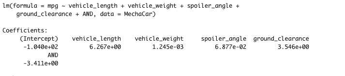
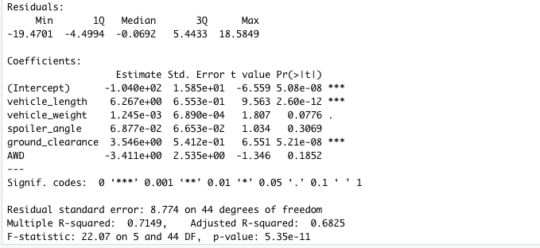
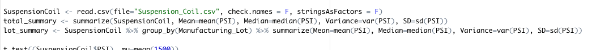
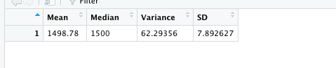
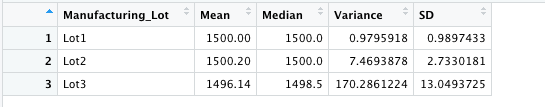
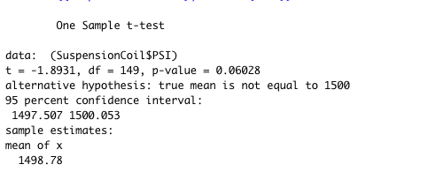
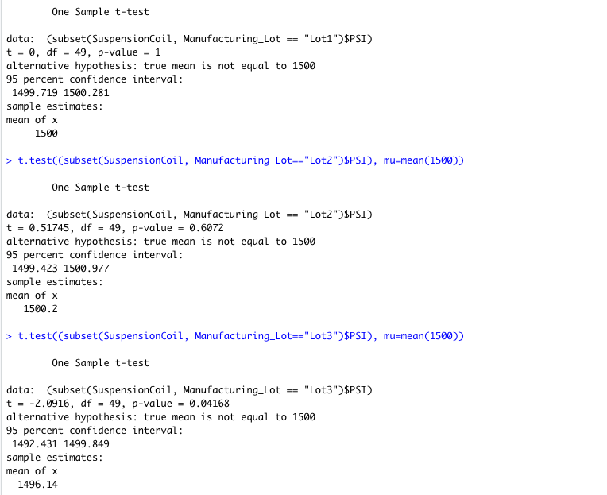

# MechaCar_Statistical_Analysis

## Linear Regression to Predict MPG

### Linear regression result:

### Summary Statistics:

According to the vehicle_length and ground_clearance provided a non-random amount of variance for the MPG value as P-value is below 0.05. The slope of the linear model consider to be 0 because the P-value of the model is 5.35e-11 that below 0.05. In the linear model has strong correlation coefficient because the R-squared value is 0.7149 that can effectively predict the MPG of MechaCar prototypes.

## Summary Statistics on Suspension Coils

### Total summary & lot summary dataframes:

### Total Summary:

### Lot Summary:

To overall the MechaCar suspension coil that perform the mean of PSI is 1498.78, median is 62.29356 and standard deviation is 7.89. - Lot1: mean of the PSI is 1500, variance is 0.98, standard deviation is 0.99 - Lot2: mean of the PSI is 1500.20,variance is 7.47, standard deviation is 2.73 - Lot3: mean of the PSI is 1496.14,variance is 170.29, standard deviation is 13.05 Look at the variability between Lot1 and Lot2 are less than Lot3.

## T-Tests on Suspension Coils

### T-Test for all manufacturing lots:

### T-Test for 3 manufacturing lots individually:

Base on the P-value of the T-Test sample for Lot1 and Lot2 are more than 0.05 since we cannot reject the null hypothesis and both of their means are similar with the population mean.

## Study Design: MechaCar vs Competition

Between MechaCar performs against the competition. We are using hypothesis testing and statistics do on data analytics. I recommend do the differences in average highway fuel economy of vehicle classes from the mpg dataset is more visualized for our consumers to review what type of vehicles are better for them. On the other side, the MechaCar need to focus on different metrics for the variable classes of vehicles that become important for MechcCar increase its potential competition with other competitor.

The null hypothesis is no statistical difference between the cost/cty(city fuel efficiency)for mechaCar's mean and competitor. Alternative hypothesis is statistical difference bewteen the cost/cty for mechaCar's mean and competitor. We will use T-Test to test the hypothesis because it can compare the mean and P-value of different dataset. If the P-value is higher than 0.05 that we won't able to reject the null hypothesis. The cost/city fuel efficiency are needed to run the statistical test.
